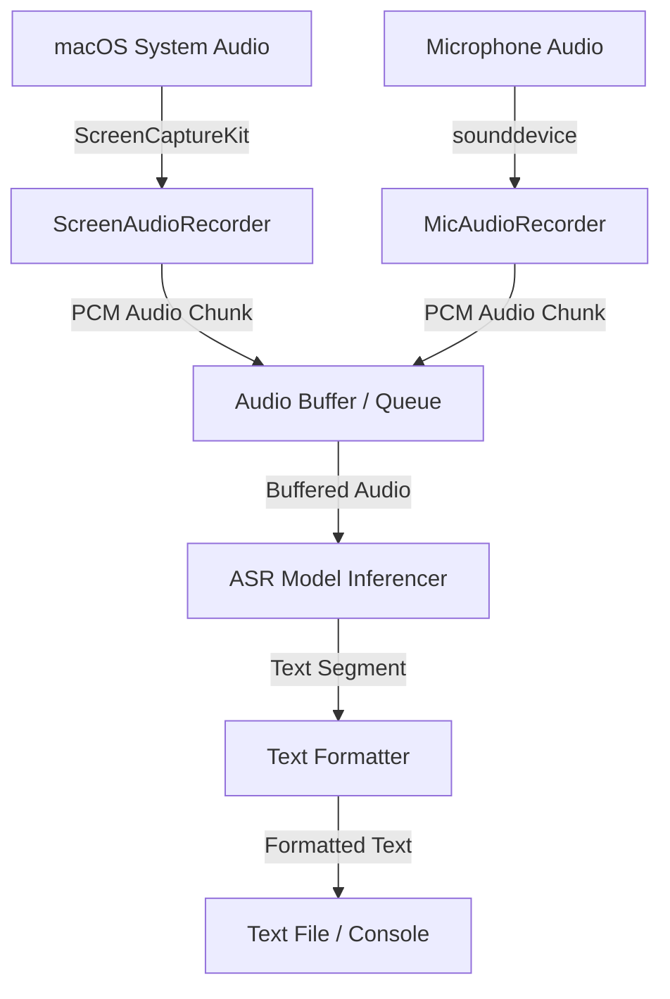

# Design Document - Screen Audio Transcriber

## Overview
The application monitors macOS system audio and transcribes it in real-time or near real-time to a text file. It is designed to run locally on macOS with support for Chinese and English.

## Architecture

### 1. Audio Capture (`src/transcribe/audio/`)
*   **Method**: `ScreenCaptureKit` or `sounddevice`.
*   **Classes**:
    *   `ScreenAudioRecorder`: Captures internal system audio using `ScreenCaptureKit` without requiring virtual audio drivers (like BlackHole).
    *   `MicAudioRecorder`: Captures microphone audio using `sounddevice` (PortAudio), providing support for speaking into the machine.
*   **Factory**: `get_recorder(source_type)` handles instantiation based on the user's choice.
*   **Data output**: Both produce 16kHz, float32, Mono PCM data streams into a thread-safe Queue.

### 2. ASR Model (`src/transcribe/model/`)
*   **Options**:
    1.  **SenseVoice-Small** (via `mlx-audio`):
        *   *Pros*: Extremely fast (non-autoregressive), high accuracy for Chinese/English/Cantonese, low latency, fully optimized for Apple Silicon via MLX.
        *   *Cons*: None for macOS M-chips.
    2.  **Whisper (Faster-Whisper)**:
        *   *Pros*: Standard, very reliable, easy Python integration.
        *   *Cons*: Slower inference for larger models compared to SenseVoice.
    3.  **MLX-Whisper (Apple Silicon)**:
        *   *Pros*: Highly optimized for Apple Silicon (Metal), support for large models like `Whisper Large-v3-Turbo`, excellent for Chinese-English mixed audio.
        *   *Cons*: macOS specific, slightly heavier memory footprint for large models.
*   **Recommendation**: Support multiple via a unified Interface. **SenseVoice-Small** is recommended for general speed and low latency, and **MLX-Whisper** for largest capacity with large models.

### 3. Orchestration (`src/transcribe/core.py`, `cli.py`, `gui.py`)
*   **Core Logic (`core.py`)**: Houses `transcription_worker` and `summary_worker` which manage the background execution flow, decoupling backend processing from display logic.
*   **CLI (`cli.py`)**: Driven by `typer`. Handles commands for starting transcription logs to consoles.
*   **GUI (`gui.py`)**: Powered by `customtkinter` for a modern interface. Extends options with dropdowns, toggle buttons, dynamic custom inputs regarding summary prompts, and readable render controls.

## Data Flow
1.  User runs `transcribe start`.
2.  Application starts `ScreenCaptureKit` stream.
3.  Audio samples are continuously pushed to a queue.
4.  A background worker reads from the queue, aggregates audio into segments (e.g., with Voice Activity Detection - VAD or fixed intervals), and sends to ASR.
5.  ASR returns text.
6.  Text is appended to the output file and printed to console.

## Safety & Fallbacks
*   **ScreenCaptureKit Permissions**: The app will need Screen Recording permissions on macOS. We must handle permission checks and notify the user.
*   **Fallback**: If `ScreenCaptureKit` fails or is unsupported on older macOS versions, provide documentation on using `BlackHole` + `sounddevice`.
