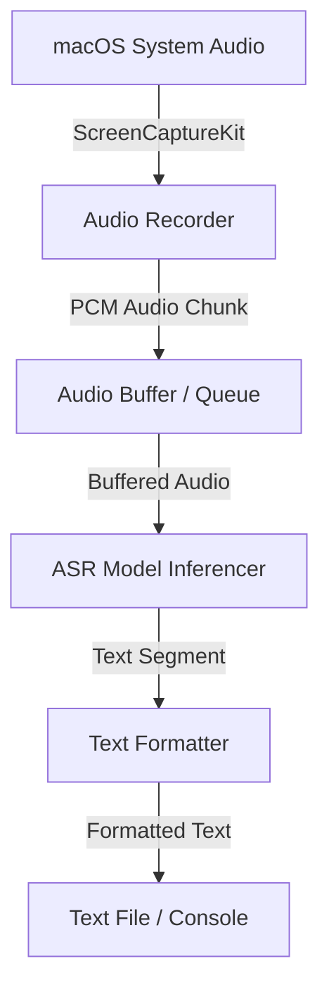

# Design Document - Screen Audio Transcriber

## Overview
The application monitors macOS system audio and transcribes it in real-time or near real-time to a text file. It is designed to run locally on macOS with support for Chinese and English.

## Architecture

### 1. Audio Capture (`src/transcribe/audio/`)
*   **Method**: `ScreenCaptureKit` (via `pyobjc-framework-ScreenCaptureKit`).
*   **Why**: Allows capturing internal system audio without requiring virtual audio drivers (like BlackHole), providing a seamless user experience.
*   **Implementation**:
    *   Create an `SCStream` capturing audio.
    *   Implement `SCStreamOutput` delegate to receive `CMSampleBuffer`.
    *   Extract PCM data and convert to appropriate format (e.g., 16kHz, 16-bit, Mono) for ASR.
    *   Push data to a thread-safe queue.

### 2. ASR Model (`src/transcribe/model/`)
*   **Options**:
    1.  **SenseVoice-Small** (Alibaba FunASR):
        *   *Pros*: Extremely fast (non-autoregressive), high accuracy for Chinese/English/Cantonese, low latency.
        *   *Cons*: Slightly newer framework, setup might be slightly heavier than whisper.cpp.
    2.  **Whisper (Faster-Whisper)**:
        *   *Pros*: Standard, very reliable, easy Python integration.
        *   *Cons*: Slower inference for larger models compared to SenseVoice.
    3.  **MLX-Whisper (Apple Silicon)**:
        *   *Pros*: Highly optimized for Apple Silicon (Metal), support for large models like `Whisper Large-v3-Turbo`, excellent for Chinese-English mixed audio.
        *   *Cons*: macOS specific, slightly heavier memory footprint for large models.
*   **Recommendation**: Support multiple via a unified Interface, defaulting to **Faster-Whisper** for stability, and **MLX-Whisper** for performance on Apple Silicon with large models.

### 3. CLI & Orchestration (`src/transcribe/cli.py`)
*   **Framework**: `typer`.
*   **Features**:
    *   `transcribe start`: Start monitoring and transcribing.
    *   Options: `--model-type [whisper|mlx-whisper]`, `--model-size SIZE`, `--output-file PATH`, `--interval INTERVAL`.

## Data Flow
1.  User runs `transcribe start`.
2.  Application starts `ScreenCaptureKit` stream.
3.  Audio samples are continuously pushed to a queue.
4.  A background worker reads from the queue, aggregates audio into segments (e.g., with Voice Activity Detection - VAD or fixed intervals), and sends to ASR.
5.  ASR returns text.
6.  Text is appended to the output file and printed to console.

## Safety & Fallbacks
*   **ScreenCaptureKit Permissions**: The app will need Screen Recording permissions on macOS. We must handle permission checks and notify the user.
*   **Fallback**: If `ScreenCaptureKit` fails or is unsupported on older macOS versions, provide documentation on using `BlackHole` + `sounddevice`.
