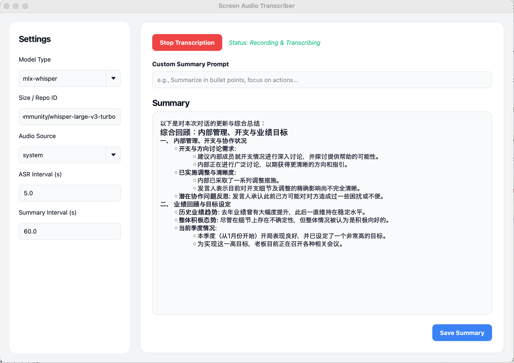

# Screen Audio Transcriber

A macOS application that monitors system audio and transcribes it locally using local ASR models (Faster-Whisper). Supports Chinese and English.

## Features
- **Zero Drivers**: Uses native `ScreenCaptureKit` — no need for BlackHole or Soundflower.
- **Local AI**: Transcribes using `faster-whisper` on your machine.
- **Multi-language**: Supports both English and Chinese auto-detection/transcription.

## Screenshots


## Requirements
- macOS 12.3 or higher (for ScreenCaptureKit integration)
- Python 3.12+
- **Screen Recording Permission**: macOS will prompt you for this when capturing starts.

## Installation

### Recommended: Install with `uv tool`
You can install and run the application directly using `uv` without cloning the source tree:
```bash
uv tool install git+https://github.com/codescv/Transcribe.git
```
This makes the `transcribe-gui` and `transcribe` commands available globally in your path environment.

### Developer Installation (Clone Source)
1. Clone or download this repository.
2. Install dependencies with `uv`:
   ```bash
   uv sync
   ```

## Usage

### GUI (Recommended)
Start the graphical interface:
```bash
transcribe-gui
```
*(If installed via Clone source, use `uv run transcribe-gui` instead)*

### CLI
Start transcribing via command line:
```bash
transcribe [options]
```
*(If installed via Clone source, use `uv run transcribe start` instead)*
```


### Options
- `--model-type`: Choose model backend: `whisper` (default), `mlx-whisper`, or `mlx-sensevoice` (SenseVoice-Small).
- `--model-size`: Size of the model (e.g., `tiny`, `base`, `small` for whisper; HuggingFace repo ID for `mlx` models, defaults: `mlx-community/whisper-large-v3-turbo` for `mlx-whisper`, `mlx-community/SenseVoiceSmall` for `mlx-sensevoice`).
- `--output-file`: Path to save transcription (default: `transcription.txt`).
- `--interval`: Buffer duration in seconds before driving inference (default: `5.0`).
- `--summary-output`: Path to save summary output (default: `None`). In continuous mode, this file is continuously updated with the latest summary.
- `--summary-interval`: Interval for continuous summarization in seconds (default: `0.0`, which disables continuous summarization). When set `> 0`, sentence-by-sentence console output is suppressed in favor of periodic updates.
- `--source`: Audio source to record. `system` (default) for system audio output via ScreenCaptureKit, or `mic` for system audio input (microphone) via sounddevice.

Example:
```bash
transcribe --model-type mlx-whisper --source system --summary-output my_meeting_summary.txt
```

## Troubleshooting
- **No Sound / No Text**: Ensure you granted "Screen Recording" permissions to Python/Terminal in System Settings > Privacy & Security.
- **Audio Device Issues**: Sound Capture depends on the active display output. Ensure audio is playing through your main speakers/headphones.

## License
MIT
